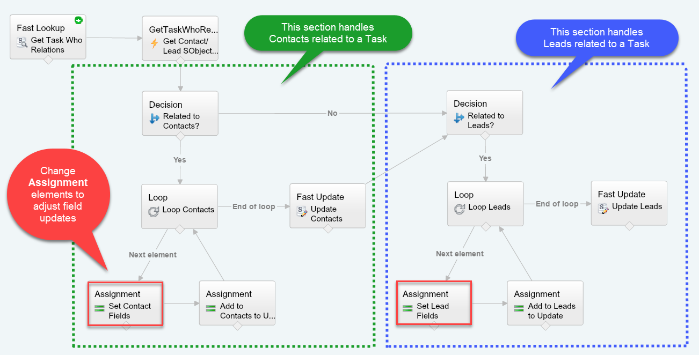

How to Update Leads or Contacts When Shared Activities Logged
=============================================================

Overview
--------

Example Process Builder and Flow to update all Contacts / Leads related to a Task when a completed activity is logged. Shared Activities feature must be enabled.

Installation
------------

* [Deploy from Github](https://githubsfdeploy.herokuapp.com)

Getting Started
---------------

1. Enable [Shared Activities](https://help.salesforce.com/articleView?id=activities_shared_considerations.htm&type=0&language=en_US&release=204.17) in `Setup | Activities | Activity Settings`
2. Deploy code and config using link above
3. Log a completed activity that is related to one or more Contacts
4. Since `TaskRelation` records are created asynchronously, wait for the Process Builder [scheduled action to complete](https://help.salesforce.com/articleView?id=process_monitor_instance.htm&type=0&language=en_US&release=204.17) (usually within a minute)
5. Navigate to any of the Contacts related with your activity and note the description has changed to "Has been related to a Task."
6. See below section on **Customizing Field Updates** to implement your desired field updates

Customizing Field Updates
-------------------------

Open the flow named **Update Contact/Lead Task Relations Flow** and find the two **Assignment** elements labeled `Set Contact Fields` and `Set Lead Fields`. Modify those to set your desired field values for Contacts and Leads, respectively.

